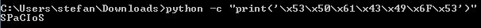

# Cracking challenges

## ELF x86 - 0 protection

We get an ELF 32-bit binary. If we run it, we get a password prompt asking us to put in a password. If we enter something, it tells us that password is incorrect. 


Firstly, we can run `ltrace` to see how the binary is checking our input. Running the command, we see the binary parse our input and allocate memory. However, we also see it comparing our input to a string: 

```C
strcmp("password", "123456789")
```

 

If we satisfy this condition to be true by entering `123456789` as the password, the binary tells us that we solved the challenge. 


The password to complete the level is `123456789`

## ELF x86 - Basic

We get an ELF 32-bit binary. If we run it, we get a username prompt asking us to input our username. Entering a random username will likely result in the binary returning "Bad username". 


Running `ltrace` gives us an error, so what we can do is run this binary in [radare2](https://github.com/radareorg/radare2). You can read the [documentation](https://readthedocs.org/projects/radare2s-website/downloads/pdf/latest/) on how to use it, but in this challenge we're just going to be visiting the grahpical view of the disassembled binary. This can be done by analyzing the binary with `aaa`


then going into hex view with `V`, navigating down towards the `main` function with the arrow keys


and then going into the graphical view with Shift+V once more. 


Once here, we go down a bit with the arrow keys and notice two strings being defined (`var_ch` as "john", and `var_10h` as "the ripper"). We notice a few things in this function. 

Firstly, we notice the calls to the `puts` function being made, showing the strings we saw when running the binary, asking us for our username. Followed by that, the `getString` function is called to get whatever string we provide, and put it into `s1`. 


Furthermore, we see the `var_ch` variable being moved to `s2`. 


After these two values (`s1`, and `s2`) are defined, they are used as parameters in the function call `strcmp`. Based on the result of this function (either true or false), the "Bad username" string is printed and the program exits, or a "password: " string is printed, presumabely asking for our password. 


Based on this string comparison, and the one done later down in the program when asking us for our password, we can conclude that the username and password for this binary are: `john:theripper`.

Using these values, we get the flag. 


The password to complete the level is `987654321`

## PE x86 - 0 Protection

We are given a PE32 executable file this time, so we'll have to use Windows to run it. Running it in a CMD prompt, the binary asks us for a password. 


First, we can look through the strings of the binary to give us any hints, you can do this by running the command `strings`. If we scroll down a bit, we can see the string that asks us for our password. However, we can also see a string that is presumably displayed when entering the correct password. 


We can begin analyzing this by looking for that string. In my case, I used [Ida Pro](https://www.hex-rays.com/products/ida/) to disassemble the binary and search for the string. 

To search for strings, press Alt+T (If you don't find it the first time, try checking the "Search Up" box and then search again).


Searching for this string brings us to the function that checks our input to see if we entered the password. 


Starting from the top of the function, we can see that it first checks to see if what we have entered is equal to 7 bytes. 

```assembly_x86
cmp    [ebp+arg_4], 7
```

After that, there are seven separate checks that compare each byte of our input to the respective hexadecimal byte. Here is the first example that compares the first byte of our input to the hex value `0x53`.


To see what input the binary is looking for in order to meet all the conditions that end up printing the `Gratz man :)` string, we need to take all of the seven hex values, and convert them to ASCII.



Just to make sure, we can provide this input when running the binary.


The password to complete the level is `SPaCIoS`

## PE DotNet - 0 Protection

We are given a PE32 DotNet executable. If we run it in Windows, we get a GUI that asks us for a password. Upon entering a bad password, it gives us a pop-up error message.


To decompile/disassemble DotNet compiled binaries, [dotPeek by JetBrains](https://www.jetbrains.com/decompiler/) is free and can be used. Run the program and import the binary.

Once imported, a good place to start looking for the password would be to see where the form the GUI button is defined, as it may trigger a function that checks and compares our input to the password.  


Double-clicking on this object, we see see a function `Button1_Click`, with the string thats returned when our bad input was given, and also presumabely the text that will be returned when we provide the right input. 


If we look at the if statement, we see that the `Operators.CompareString` function is being called with `TextBox1.Text` and `DotNetOP` as arguments. [The function](https://docs.microsoft.com/en-us/dotnet/api/microsoft.visualbasic.compilerservices.operators.comparestring?view=netcore-3.1) returns 0 if both values are equal, meaning the if the input we enter is `DotNetOP`, the congratulatory text will display. We can test this by entering that string into the text box. 


The password to complete the level is `DotNetOP`

## ELF x86 - Fake Instructions

We are given an ELF 32-bit binary. Running the binary with a random password, we get an error message telling us that the way of wisdom will guide us, and that we should find the password. 


Running `ltrace` on this binary, wee see the string our input is compared to, so naturally we use this string as our input. 


However, when we use this input, it doesn't work. If we focus on the `strcmp` call, we see that our input is sanitized, as extra escape characters are added, as well as the string being truncated to not include the last four bytes. 


To solve this, we can use [OllyDbg](http://www.ollydbg.de/) to dynamically analyze this binary, and change memory values at certain points during the run time. 