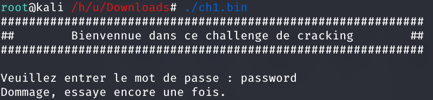

# Cracking challenges

## ELF x86 - 0 protection

We get an ELF 32-bit binary. If we run it, we get a password prompt asking us to put in a password. If we enter something, it tells us that password is incorrect. 



Firstly, we can run `ltrace` to see how the binary is checking our input. Running the command, we see the binary parse our input and allocate memory. However, we also see it comparing our input to a string: 

```C
strcmp("password", "123456789")
```

 

If we satisfy this condition to be true by entering `123456789` as the password, the binary tells us that we solved the challenge. 


The password to complete the level is `123456789`