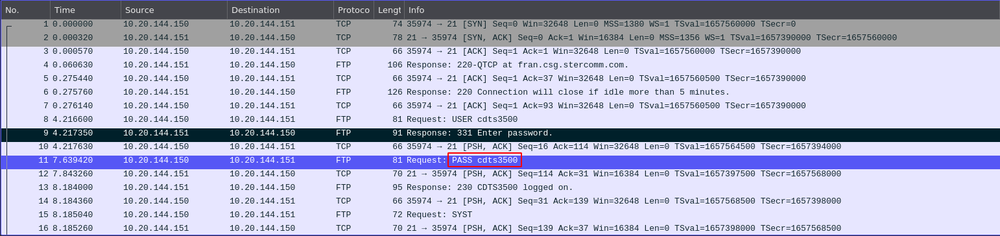
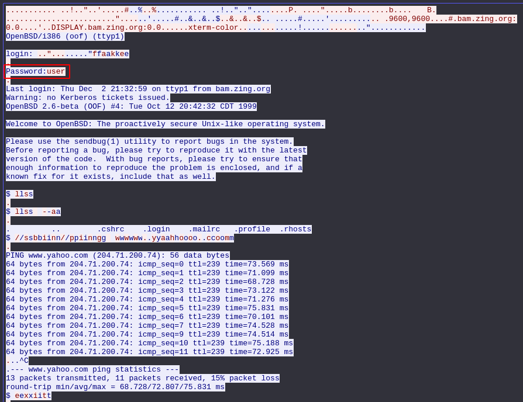
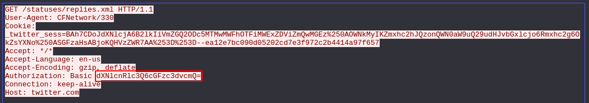
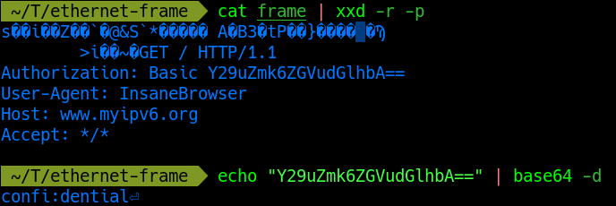
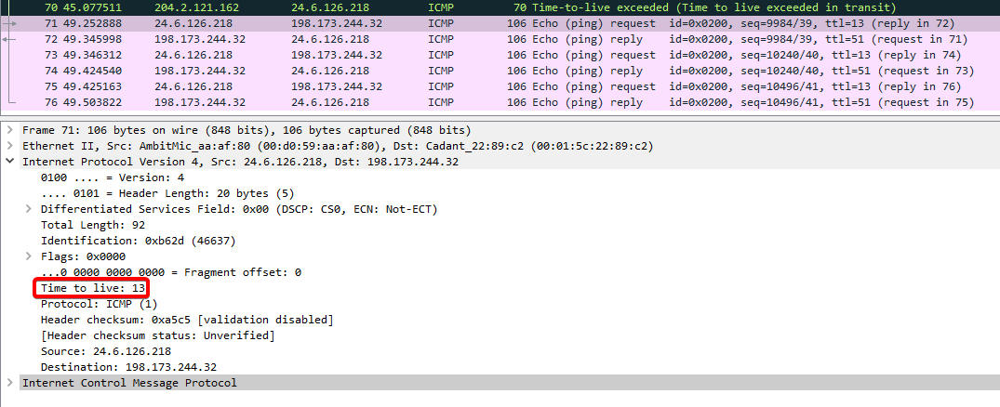
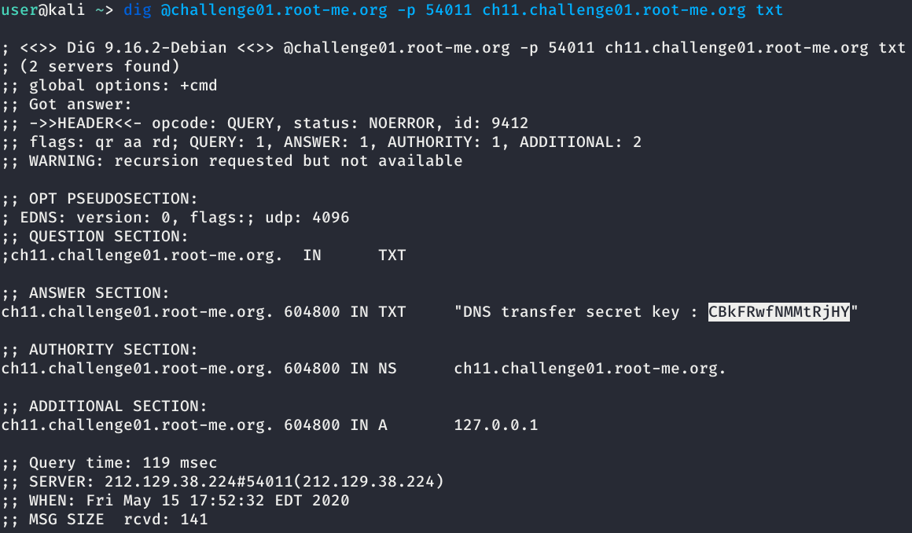
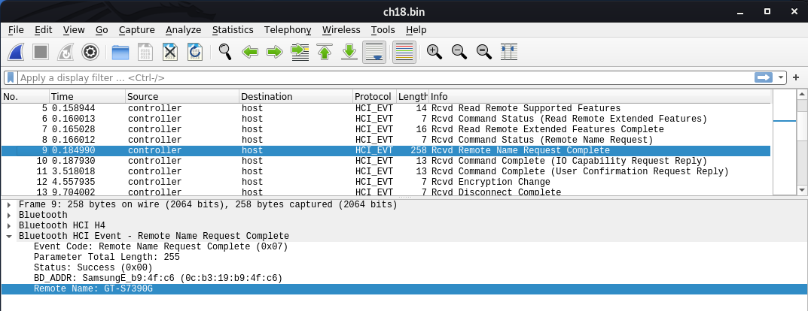
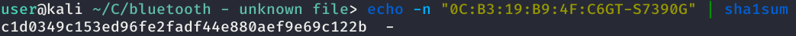

# Network challenges

## FTP - authentication

When you start the challenge, you will be prompted to download a pcap file. This file contains network traffic captured and stored in a file, and is readable using a packet analyzer such as Wireshark. Open this file in Wireshark, and you will see FTP packets going back and forth. Looking at the FTP packets, you will find the password since FTP doesn't have encryption.



The password to complete the level is `cdts3500`

## TELNET - authentication

This challenge is similar to the previous one, telnet sends credentials in plaintext because it is unencrypted. Open the file downloaded using a packet analysis tool, and look for the packet that sends credentials. With this capture, it may not be as clear as FTP, so something you can do to view the data more clearly (in Wireshark), is right-click on one of the telnet packets and click `Follow -> TCP Stream`. 



The password to complete the level is `user`

## Twitter authentication

With this capture, we only get one packet with no well defined "password" field. However if we look at headers of the packet, we see a field named "Authorization", with a string of seemingly random characters. This string of characters is a base64 encoded string, we know this by seeing that there are no special characters, only letters and numbers (and the equals sign at the end which is kind of a dead giveaway). 



Decode this base64 encoded string and you will get the password. 


The password to complete the level is `password`

## ETHERNET - frame

This challenge gives you a hexdump of what is a supposed to be an ethernet frame. Convert this hexdump into ASCII, and repeat the steps from the previous challenge.



The password to complete the level is `confi:dential`

## IP - Time To Live

In this challenge, we are given a `pcap` file to analyze, and look for the TTL used to reach the target in the ICMP packet exchange. Open this file in [Wireshark](https://www.wireshark.org/), and scroll all the way down until you start to see the "Time-to-live exceeded" messages disappearing. 

What we are seeing here is the ICMP request packets gradually increasing their TTL by 1 each time the "Time-to-live exceeded" message arrives. Eventually, the TTL will be high enough that it will reach its destination without dying.

 You should arrive at packet 71. Select the packet, and expand the IPv4 window near the bottom. The TTL is going to be the flag. 



The password to complete the level is `13`

## DNS - Zone Transfer

In this challenge, we have to perform a DNS zone transfer to `ch11.challenge01.root-me.org`. We are given the host DNS server and port. Using `dig`, we can perform this transfer and request a `TXT` record.

```shell
dig @challenge01.root-me.org -p 54011 ch11.challenge01.root-me.org txt
```



The password to complete the level is `CBkFRwfNMMtRjHY`

## Bluetooth - Unknown File

In this challenge, we are given a "BTSnoop" file with the goal of finding the MAC address and name of a phone communicating in a Bluetooth session. 

This special file can be opened in [Wireshark](https://www.wireshark.org/). Once opened, go to packet 9, where a name request is fulfilled. Looking into the Bluetooth HCI Event header, we can see the MAC address and the name of the Phone.



Pipe the MAC address and Name into `sha1sum` to get the sha1 hash.



The password to complete the level is `c1d0349c153ed96fe2fadf44e880aef9e69c122b`