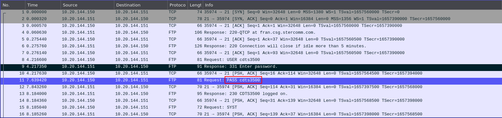
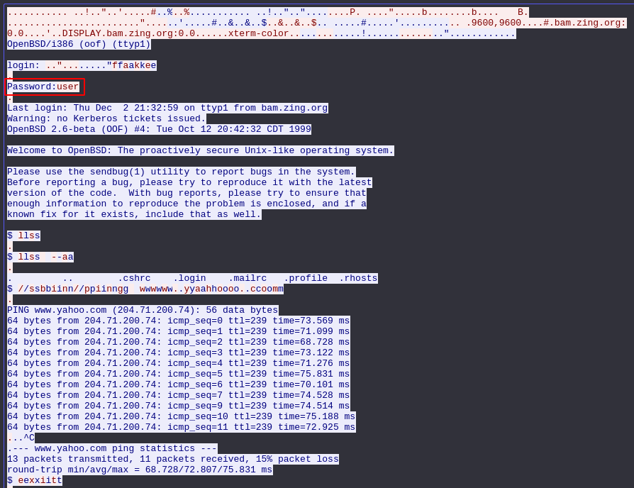

# Network challenges

## FTP - authentication

When you start the challenge, you will be prompted to download a pcap file. This file contains network traffic captured and stored in a file, and is readable using a packet analyzer such as Wireshark. Open this file in Wireshark, and you will see FTP packets going back and forth. Looking at the FTP packets, you will find the password since FTP doesn't have encryption.

The password to complete the level is `cdts3500`

## TELNET - authentication

This challenge is similar to the previous one, telnet sends credentials in plaintext because it is unencrypted. Open the file downloaded using a packet analysis tool, and look for the packet that sends credentials. With this capture, it may not be as clear as FTP, so something you can do to view the data more clearly (in Wireshark), is right-click on one of the telnet packets and click `Follow -> TCP Stream`. 

The password to complete the level is `user`
