## Web-Server Challenges

## HTML - Source Code

Look in the source code of the HTML page and you will see the password. 

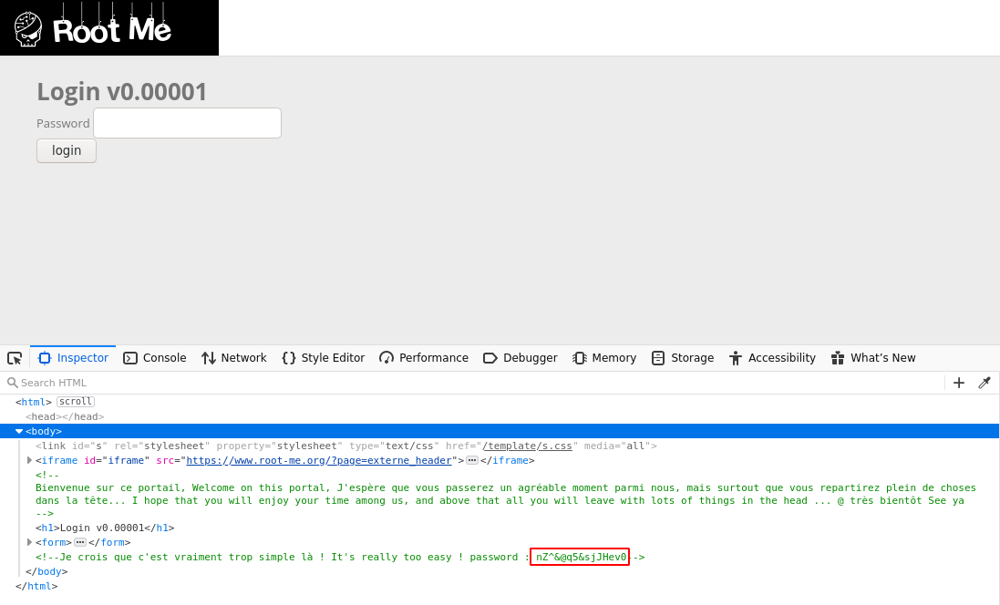

What's interesting is that if you don't use the inspector, the password will be tabbed so far right that you might miss it if you don't scroll sideways.

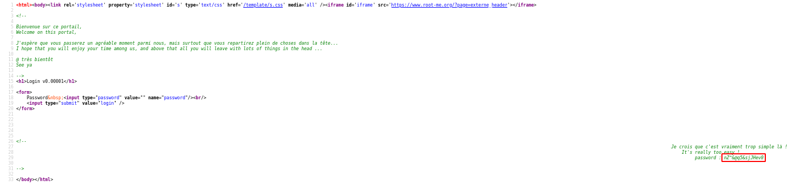

The password to complete the level is `nZ^&@q5&sjJHev0y`

## Weak password

Guess the credentials. After guessing, the credentials end up being:<br>
username: `admin`
password: `admin`

The password to complete the level is `admin`

## HTTP - User-agent

For this challenge you need to request the web page with the `user-agent` string being `admin`. 
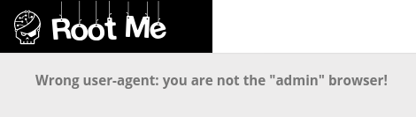

You can do this using the following curl command: 
```shell
curl --user-agent "admin" http://challenge1.root-me.org/web-serveur/ch2/
```
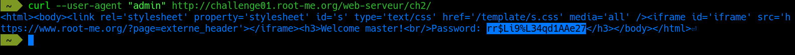

The password to complete the level is `rr$Li9%L34qd1AAe27`

## HTTP - Directory Indexing

This challenge provides you with the supposed directory for the password in the source code of the page.

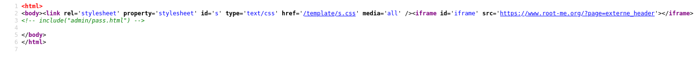

However, if you visit the page, there's nothing there. 

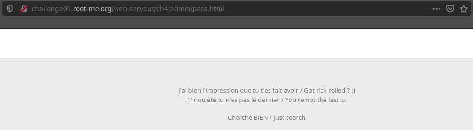

If you go back and pay closer attention to the directory they gave you, it turns out to be a subdirectory, with the root directory being `/admin`. Navigate to `/admin` and you'll be able to see more files. 

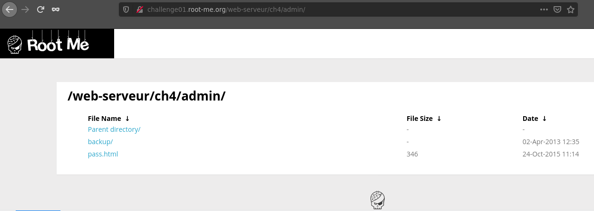 

The password should be in `/admin/backup/admin.txt`.

The password to complete the level is `LINUX`

## Backup File

This one is a bit trickier. You are given a username and password field, but the intended solution doesn't include any improper text sanitization. If you are a vim god, you would know that [vim backup files are stored as the original name of the file, with a tilde character at the end of the filename.](https://medium.com/@Aenon/vim-swap-backup-undo-git-2bf353caa02f) 

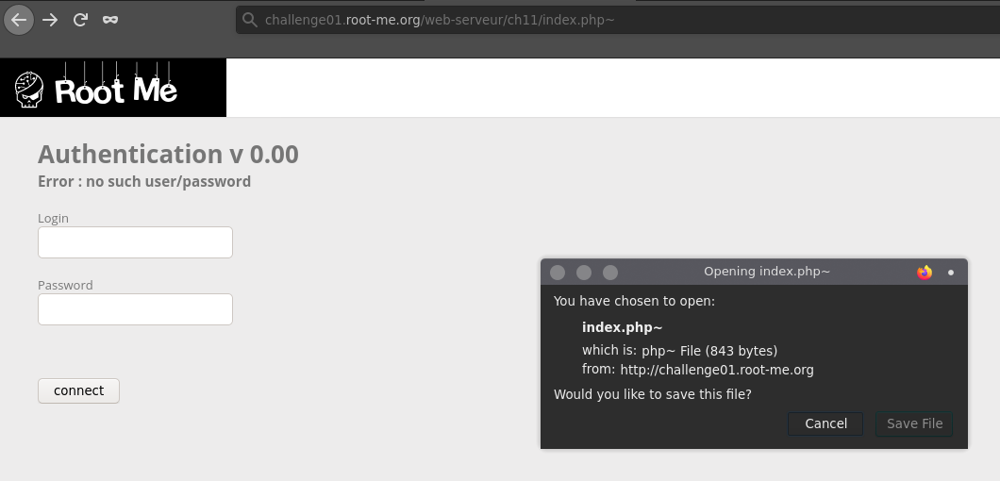

Knowing this, just navigate to `/index.php~`, and download the file. There, you will find the password. 

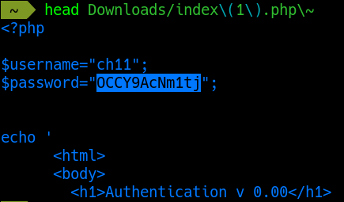

The password to complete the level is `0CCY9AcNm1tj`

## PHP - Command injection

The first thing we see is a text field that accepts IP addresses, pings them, and returns the output as if it was a shell command. 

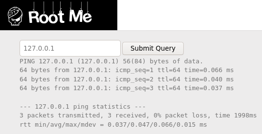

Seeing the output look like it came from a unix shell, trying to put commands such as `ls` sounds like a good idea, but there seems to be some sanitization. To get around this, you can put in an IP address, along with another command using the `&` symbol. In the description of the challenge, it says the flag is in the `index.php` file, but if you look at the source code of the page, there's nothing there. Assuming that file is on the compromised service, we can inject a command to cat the file, and grep for the flag. The command I used was:
```shell
127.0.0.1 & cat index.php | grep flag
```

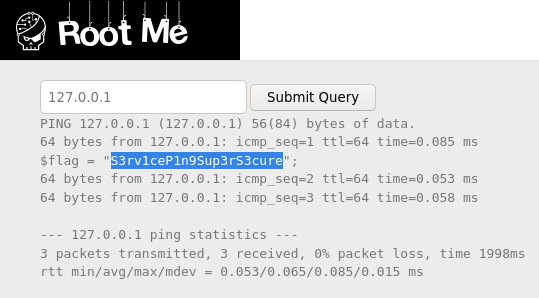

The password to complete the level is `S3rv1ceP1n9Sup3rS3cure`

## HTTP - Headers

From the challenge name, we assume that it has something to do with the headers. To get the headers of the web page, we can use a curl command:

```shell
curl --head http://challenge01.root-me.org/web-serveur/ch5/
```

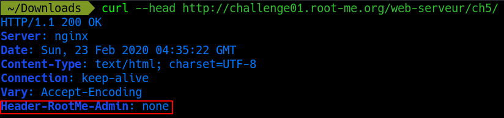

Now we know what the headers are, we can change them using the curl command:

```shell
curl --include --header "Header-RootMe-Admin: Administrator" http://challenge01.root-me.org/web-serveur/ch5/
```

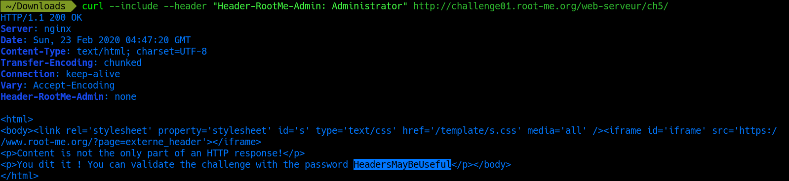

The password to complete the level is `HeadersMayBeUseful`

## HTTP - Verb tampering

When visiting the web page for this challenge, we are asked for credentials.

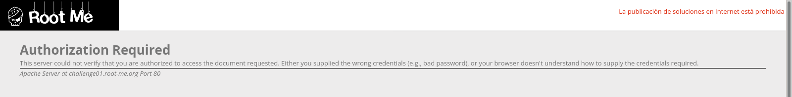

However, the intended solution for this challenge is not to manipulate input sanitization, but to tamper with different HTTP methods, called [verb tampering](https://wiki.owasp.org/index.php/Testing_for_HTTP_Verb_Tampering_(OTG-INPVAL-003)). We can use curl commands to request the web page with different verbs, and find the password.
	
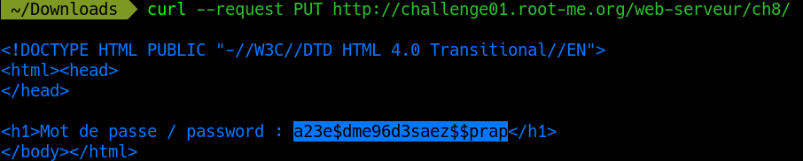

The password to complete the level is `a23e$dme96d3saez$$prap`

## HTTP - POST

With this challenge, we are greeted with a fun little game that generates a random number every time you click the button. 

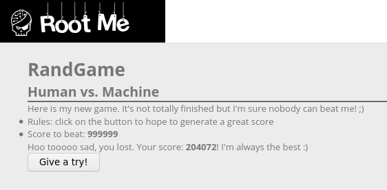

After seeing the source code, we see that the button sends a POST request with two values: `generate` and `score`. 

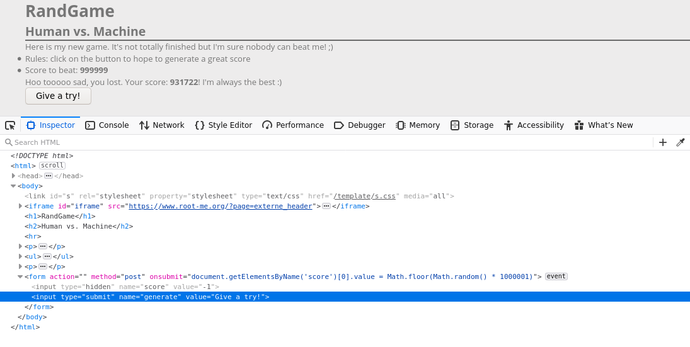

We can use CURL to send a POST request with a score over `999999` (If you send a POST request with just a `score` parameter, it won't work, make sure to include the `generate` value as well). We can use the CURL command: 

```shell
curl --request POST --form 'generate=Give+a+try%21' --form 'score=1000000' http://challenge01.root-me.org/web-serveur/ch56/
```

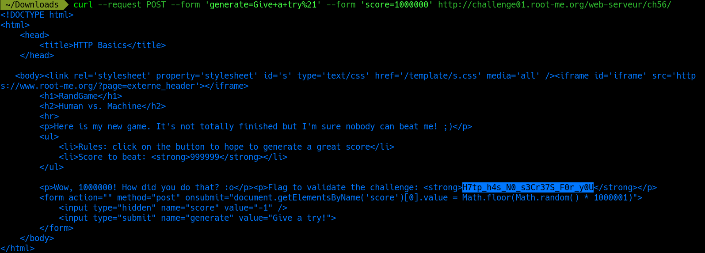

THe password to complete the level is `H7tp_h4s_N0_s3Cr37S_F0r_y0U`
